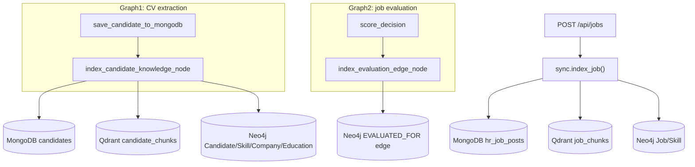

# Knowledge Stores: MongoDB + Qdrant + Neo4j

This document describes the three-store architecture that backs candidate
and job data: MongoDB (source of truth), Qdrant (vector search), and Neo4j
(knowledge graph). Qdrant and Neo4j are **derived indexes**: a write failure
in either never blocks or rolls back the MongoDB write, which remains
authoritative.

This infrastructure is intentionally storage-only. It does not include an
Agent tool-calling/free-exploration layer; the functions described here are
designed to be called directly by such a layer in a future phase.

Last reviewed: 2026-08-11

## 1. Why three stores

| Store | Role | Good for |
|---|---|---|
| MongoDB | Source of truth | Full candidate/job documents, exact filters, existing dashboard/export APIs |
| Qdrant | Vector search | Semantic recall over CV/JD text chunks (paraphrases, related skills) |
| Neo4j | Knowledge graph | Multi-hop relationships (Candidate-Skill-Job-Company), explainable traversal |

See [docs/CANDIDATE_DATA_AND_JOB_MATCHING.md](CANDIDATE_DATA_AND_JOB_MATCHING.md)
for how candidate/job data is extracted before it reaches these stores.

## 2. Architecture



## 3. Embedding

Embeddings use SiliconFlow's OpenAI-compatible `/v1/embeddings` endpoint via
the existing `langchain-openai` dependency, so no dedicated SDK was added.

- [backend/services/knowledge/embedding_provider.py](../backend/services/knowledge/embedding_provider.py)
- Configurable via `EMBEDDING_MODEL`, `EMBEDDING_BASE_URL`, `EMBEDDING_API_KEY`,
  `EMBEDDING_DIM` (see [env.example](../env.example)).
- Default model: `BAAI/bge-m3` (1024 dimensions). Swapping to another
  SiliconFlow embedding model only requires changing environment variables.

## 4. Qdrant (vector search)

### Collections

| Collection | Config var | Payload fields |
|---|---|---|
| Candidate chunks | `QDRANT_COLLECTION_CANDIDATES` (default `candidate_chunks`) | `candidate_id`, `chunk_type`, `text`, `source_ref` |
| Job chunks | `QDRANT_COLLECTION_JOBS` (default `job_chunks`) | `job_id`, `chunk_type`, `text`, `source_ref` |

`chunk_type` values:
- Candidate: `summary`, `experience`, `education`, `skills`
- Job: `description` (short JD) or `requirement_section` (paragraph split)

Chunking logic: [backend/services/knowledge/chunking.py](../backend/services/knowledge/chunking.py).
Rather than embedding an entire CV/JD as one vector, each experience entry,
education entry, and requirement paragraph becomes its own point so retrieval
can target a specific section.

### Point IDs and idempotency

Point ids are deterministic (`uuid5` of `{entity_id}:{chunk_type}:{index}`).
Every sync call first deletes existing points for that `candidate_id`/`job_id`
(by payload filter) and then upserts the fresh set, so re-processing never
leaves stale chunks behind when the underlying data shrinks.

### Reusable functions

[backend/services/knowledge/vector_index.py](../backend/services/knowledge/vector_index.py):

```python
await upsert_candidate_vectors(candidate_id, chunks)
await upsert_job_vectors(job_id, chunks)
await search(collection, query_text, filters={"candidate_id": "..."}, top_k=10)
```

`search()` has no FastAPI/LangGraph dependency, so a future Agent tool layer
can call it directly.

## 5. Neo4j (knowledge graph)

### Schema

```text
(:Candidate {candidate_id, name, email})
(:Job {job_id, title})
(:Skill {name})            # normalized: lowercase + trim
(:Company {name})
(:Education {degree, institution})

(Candidate)-[:HAS_SKILL {source}]->(Skill)
(Candidate)-[:WORKED_AT {title, duration}]->(Company)
(Candidate)-[:HAS_EDUCATION]->(Education)
(Job)-[:REQUIRES_SKILL {skill_type: "tech"|"soft"}]->(Skill)
(Candidate)-[:EVALUATED_FOR {score, tag, timestamp}]->(Job)
```

Uniqueness constraints (`candidate_id`, `job_id`, `Skill.name`, `Company.name`)
are created on startup by
[backend/core/neo4j_client.py](../backend/core/neo4j_client.py) `ensure_constraints()`.

### Idempotency

All writes use `MERGE`. Before re-creating a candidate's or job's
relationships, existing edges of the same type are deleted first
(`upsert_candidate_graph`/`upsert_job_graph` in
[backend/services/knowledge/graph_index.py](../backend/services/knowledge/graph_index.py)),
so batch re-imports and re-evaluations don't accumulate duplicate or stale
edges.

Skill names are normalized with `normalize_skill()` (lowercase + trim). Alias
resolution (e.g. "K8s" == "Kubernetes") is not implemented yet; see
"Out of scope" below.

## 6. Sync orchestrator

[backend/services/knowledge/sync.py](../backend/services/knowledge/sync.py) is
the single entry point used by both LangGraph nodes and API routes:

```python
await sync.index_candidate(candidate_id, name, email, extracted_cv_data, summary)
await sync.index_job(job_id, title, description, tech_skills, soft_skills)
await sync.index_evaluation(candidate_id, job_id, score, tag)
```

Each function catches its own exceptions per store and returns
`{"errors": [...]}` instead of raising, so a Qdrant or Neo4j outage never
fails the caller.

## 7. Where syncing is triggered

| Trigger | File | Node/function |
|---|---|---|
| Candidate saved (Graph1) | [backend/services/hr/graph/cv_extraction_workflow.py](../backend/services/hr/graph/cv_extraction_workflow.py) | `index_candidate_knowledge_node` (runs after `save_candidate_to_mongodb`) |
| Job created | [backend/api/routes/jobs.py](../backend/api/routes/jobs.py) `create_job()` | Calls `sync.index_job()` after `insert_one` (also extracts+caches `job_skills`) |
| Evaluation scored (Graph2) | [backend/services/hr/graph/job_evaluation_workflow.py](../backend/services/hr/graph/job_evaluation_workflow.py) | `index_evaluation_edge_node` (runs after `score_decision`) |
| Batch import | [backend/services/hr/batch_processing.py](../backend/services/hr/batch_processing.py) | Reuses `process_cv_upload()`/`evaluate_job_against_all_candidates()`, so both graphs' new nodes run automatically |

## 8. Startup and health

`lifespan()` in [backend/main.py](../backend/main.py) calls
`ensure_collections()` (Qdrant) and `ensure_constraints()` (Neo4j) after
`ensure_indexes()` (MongoDB). Any failure is logged as a warning; the API
still starts.

`GET /health` includes best-effort connectivity for both stores:

```json
{
  "status": "healthy",
  "config": {
    "llm_provider": "openai",
    "qdrant": "ok",
    "neo4j": "ok"
  }
}
```

## 9. Running the infrastructure

```bash
docker compose up -d qdrant neo4j
```

- Qdrant REST/dashboard: `http://localhost:6333/dashboard`
- Neo4j Browser: `http://localhost:7474` (user/password from `NEO4J_USER`/`NEO4J_PASSWORD`)

## 10. Backfilling existing data

Candidates/jobs/evaluations created before this pipeline existed are not
automatically indexed. Run the backfill script once after Qdrant/Neo4j are up:

```bash
uv run python -m backend.scripts.backfill_knowledge_stores
# or backfill just one entity type:
uv run python -m backend.scripts.backfill_knowledge_stores --only candidates
```

The script is safe to re-run; every `sync.*` call is idempotent.

## 11. Out of scope (next phase)

- Agent tool-calling / `create_react_agent` / MCP integration that lets an
  Agent freely combine MongoDB filters, Qdrant search, and Neo4j traversal.
- Skill alias resolution across languages/abbreviations (e.g. "K8s" =
  "Kubernetes").
- Folding Qdrant similarity and Neo4j graph signals into the evaluation score
  formula (today's score is produced solely by the evaluation LLM; see
  [docs/CANDIDATE_DATA_AND_JOB_MATCHING.md](CANDIDATE_DATA_AND_JOB_MATCHING.md)).
